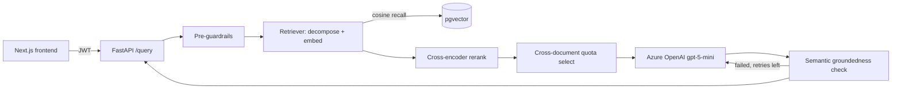

# DeployIQ — RAG Backend: Hardening & Evaluation Plan

**Status:** ✅ Phases 0–10 complete — latency budget redefined to cover retrieval + guardrails only (see §6). ✅ Phase 11 complete — DB-backed chat sessions, client-IP tracking, per-user/per-IP rate limiting, spam guardrail, and latency optimizations (reranker preload, groundedness-embedding reuse, tuned reasoning effort) added after Phase 10 closed out (see §5a).
**Source of truth (corpus):** `backend/data/real_docs/*.md` — 8 authoritative DeployIQ website Markdown documents (home page, about us, platform overview, Zero Trust, Essential Eight ×2, Responsible AI, Trust Center)
**Purpose of this document:** a self-contained brief a fresh session (or any developer) can pick up cold, without needing prior chat history. Every decision below reflects what was actually implemented and verified with real Azure calls — not aspirational design. If something here seems wrong, flag it back to the human rather than silently deciding differently.

**Reference note:** an earlier planning document for a *different* project (ET Platform SOW module) was used purely as a **structural template** for this file — none of its content (SOW/funding/Gantt/docx material) applies here. Everything below is specific to this RAG backend.

---

## 0. What this project is
DeployIQ is turning its own website content into a working Retrieval-Augmented Generation assistant: a FastAPI + PostgreSQL/pgvector backend that chunks, embeds, and retrieves from 8 Markdown pages, and a Next.js chat/documents/metrics frontend. The starting point was a working-but-flawed scaffold (routes/schemas/module boundaries already in place) whose retrieval and guardrail logic produced bad results on the real corpus — this plan documents the rebuild of that logic into something verified against real Azure OpenAI calls, plus the evaluation/test harnesses that keep it that way.

**The retrieval + chunking quality is the highest-risk element of this project.** Auth, CRUD, and the frontend shell were already solid. Getting chunk boundaries, cross-document retrieval, and groundedness checks *actually correct on the real corpus* — not just "runs without errors" — was where the real work was.

---

## 1. Finalized decisions (do not re-open without re-verifying against the real corpus)

| Area | Decision |
|---|---|
| LLM | Azure OpenAI `gpt-5-mini` (reasoning model). **Only** `temperature=1.0` is accepted by the API — any other value throws. Grounding is enforced via the prompt + post-hoc checks, not via temperature. |
| Token limits | `max_completion_tokens` (not `max_tokens` — gpt-5-mini rejects the old param). Set generously (1400) because reasoning tokens are spent *before* visible text; too low silently returns an empty answer. |
| Embeddings | Azure OpenAI `text-embedding-3-small`, 1536-dim. Must match the pgvector column width (`alembic f9462f0a85c6`) — config defaults were previously wrong (`BAAI/bge-base-en-v1.5`, 768-dim, inherited from the scaffold) and have been corrected. |
| Chunking strategy | Structure-aware (ATX headings only), **not** semantic chunking — the corpus already has authored headings, and semantic chunking would be noisier/non-deterministic. Standalone bold lines (numbered items, UI labels, CTAs) are explicitly **not** section boundaries — they were the root cause of fragmentation (96 chunks → 36 after the fix). |
| Chunk-level nesting | A heading closes the open section only when its level is same-or-shallower; deeper headings fold in. A heading level that occurs only once in a document (a lone page-title H1) is treated as non-anchoring front matter and deferred forward, so it doesn't swallow every following section — see `app/chunking/structure_aware.py`. |
| Reranking | Cross-encoder (`fastembed` ONNX, `Xenova/ms-marco-MiniLM-L-6-v2`) — chosen over sentence-transformers/torch specifically because `fastembed`+`onnxruntime` were already in `requirements.txt`. The cross-encoder **reorders only**; the score exposed downstream stays raw cosine similarity, because cross-encoder logits are not on a comparable, query-independent scale (verified empirically — see §7 risk #2). |
| Retrieval diversity | Cross-document quota (round-robin across the top 2–3 scoring documents), not the single-strongest-document-wins behavior the scaffold shipped with. Dedupe is by chunk id, not `(source_name, section_heading)` — headings legitimately repeat (e.g. "Key Features" appears in more than one document). |
| Compound questions | Rule-based `decompose_query()` (multiple `?`, or an `and` joining two substantial clauses) — no LLM call spent on splitting. Toggleable via `Settings.enable_query_decomposition`. |
| Groundedness | Semantic (embed the answer + each retrieved chunk, cosine similarity ≥ threshold), not lexical token overlap — the old heuristic falsely rejected short, correctly-paraphrased answers. An explicit negative-answer allowance (regex) treats a correct "the documents don't specify X" as grounded, not a hallucination. |
| Generation retry | Because `temperature=1.0` makes phrasing vary run-to-run for the *identical* question, a failed groundedness check now triggers a fresh LLM resample (up to `MAX_LLM_RETRIES=2` extra attempts) before falling back — this measurably reduces flaky "I don't have enough grounded information" responses on questions that are actually answerable. |
| Auth | JWT (HS256), issued by `/auth/login` / `/auth/register`, validated per-request. No RBAC — every authenticated user has full access (matches the project's actual current scope; not a deferred decision, just not a requirement here). |
| Chat sessions | DB-backed per-user history (`app/core/sessions.py`, `chat_sessions`/`chat_messages` tables), never client-trusted. An explicit, non-expired `session_id` is always reused as-is; with no `session_id`, the most recent non-expired session **created from the same client IP** is resumed, else a fresh session starts. Expired/unknown/foreign session ids never error — they silently rotate to a new session. 1-hour inactivity TTL (`session_timeout_minutes`), refreshed on every message. |
| Client IP | `app/core/request_meta.get_client_ip()` — trusts `X-Forwarded-For` (first hop) only when `trust_proxy_headers` is enabled (real reverse-proxy deployments); otherwise uses the direct TCP peer address. Used for session-resume matching, audit logging, and per-IP rate limiting. |
| Rate limiting | In-memory sliding window on `/query` only (`app/core/rate_limit.py`), two independent limits: per-user (`rate_limit_per_minute`, default 10/min) and per-IP (`rate_limit_per_minute_per_ip`, default 30/min, looser since multiple real users can share one office/NAT IP). Per-process only — would need a shared store (e.g. Redis) if scaled to multiple uvicorn workers. |
| Spam/gibberish guardrail | `check_spam` in `app/guardrails/pre_checks.py` — vowel-ratio on long alphabetic tokens, char/word repetition, URL + promotional-phrase regex. Blocked pre-retrieval/pre-LLM (near-zero latency cost), never returns sources. |
| Unsupported-info phrasing | The model must never say "the documents don't specify/cover/mention X" for a genuine retrieval gap — it silently omits that part of the answer instead (reduces hallucination-adjacent phrasing that invites users to probe for a workaround). Exception: if the source document itself states a real negative fact (e.g. "not yet claimed"), that's reported since it's documented content, not a gap. |
| Frontend evidence display | Sources / per-source match % are only shown in the chat UI when `grounded === true` — showing "5 sources, 57% match" next to a declined/off-topic answer was confusing and has been fixed (`components/MessageBubble.tsx`). |
| Test strategy | Two complementary harnesses, not one: `backend/tests/` (pytest, ~67 tests, mocked, no live DB/Azure, ~2s) for logic correctness, and `scripts/run_evaluation.py` (real DB + real Azure calls) for actual pipeline quality/latency against the live corpus. Neither replaces the other. |
| Latency budget | **RESOLVED — see §6.** The original brief requires the entire pipeline (chunking + retrieval + generation) under 200ms with P50/P70/P100 reporting. Measured reality: LLM stage alone is ~8s at P50 (`scripts/run_evaluation.py` output), full pipeline ~18s at P50 — not fixable by optimizing retrieval, it's the real cost of a synchronous reasoning-model call. Decision: `Settings.latency_budget_ms` now applies only to `guardrail_pre + retrieval + guardrail_post` (`pipeline_ex_llm` in `/metrics/latency`); `end_to_end` and `llm` are reported separately with no budget verdict. Even the redefined metric still exceeds 200ms in real runs (retrieval/guardrails alone take seconds) — reported honestly, not silently marked as met. |

---

## 2. Functional specification — what the pipeline actually does

### 2.1 Chunking (`app/chunking/`)

- **`structure_aware.py`** — the corpus's primary strategy for markdown. Only ATX headings (`#`..`######`) create section boundaries; bold-wrapped heading text (`## **Platform Overview**`) has its `**` stripped for clean `section_heading` metadata. Nesting rule: a same-or-shallower heading closes the current section; a deeper heading folds in (so `### Understand` / `### Recommend` / ... under `## How Our Platform Works` become one chunk, not five). A heading level appearing only once in a document (a lone `# Page Title`) is deferred forward into whichever heading opens the next real section, rather than anchoring and swallowing the rest of the document. Oversized sections (> `max_chunk_chars`, default 2000) are split at paragraph boundaries only — never mid-sentence.
- **`metadata_aware.py`** — thin wrapper tagging `strategy`/`base_strategy`. Previously also built unused `parent_context`/`sibling_range` fields (dead code, since STEP-1 chunking already yields coherent full-section chunks) — removed rather than wired up.
- **`fixed_size.py` / `semantic.py`** — alternative strategies retained for non-markdown source types, selected via `factory.get_strategy(name, source_type)`.
- Result on the real corpus: **96 → 36 chunks**, min-chunk-under-150-chars dropped from the majority to 2, without hand-tuning per document.

### 2.2 Retrieval (`app/retrieval/`)

Pipeline order, per query (see `vector_store.py`):
1. Broad pgvector cosine-distance recall (~5× the requested `top_k`, min 25).
2. Dedupe candidates by chunk id (keep best cosine score).
3. Cross-encoder rerank (`reranker.py`) — reorders only, cosine score preserved.
4. Cross-document quota selection (`_select_diverse_chunks`) — round-robin across the top 2–3 scoring documents with per-document quotas, then backfill remaining slots by score.

`retriever.py` additionally: detects compound questions and runs the above once per sub-query, merging results round-robin so neither sub-topic is crowded out by the other's higher-scoring chunks.

### 2.3 Guardrails (`app/guardrails/`)

- **Pre** (`pre_checks.py`): query length, prompt-injection pattern match (`"ignore previous instructions"`, `"system prompt"`). Domain/off-topic filtering is deliberately **not** done here — it's evaluated post-retrieval instead, so semantic queries without exact keyword matches aren't wrongly rejected.
- **Post** (`post_checks.py`): `check_has_sources` (no sources / low max score → `no_retrieved_sources` / `low_retrieval_confidence`), `check_groundedness` (semantic cosine similarity between answer and retrieved chunks, with a negative-answer regex short-circuit for correct declines).

### 2.4 Harness / orchestrator (`app/harness/orchestrator.py`)

`run_query()`: pre-guardrails → retrieval → retrieval-relevance gate (`MIN_RETRIEVAL_SCORE=0.35` on raw cosine, deliberately *not* the reranked score — see §7 risk #2) → LLM generation, retried on groundedness failure (not just on empty/error) up to `MAX_LLM_RETRIES` → structured `QueryResponse`. Every stage is timed into `stage_timings` for the latency middleware.

### 2.5 Generation (`app/harness/prompts.py`)

System + user prompt frames DeployIQ as the active subject of every answer ("DeployIQ manages...", not passive voice), caps the answer at `Settings.answer_max_words` (150), includes 2 few-shot examples using only facts supported by the real corpus, and explicitly instructs the model to answer supported parts of a multi-part question even if one part isn't covered. Uses `max_completion_tokens`, never `max_tokens`.

### 2.6 Evaluation (`app/evaluation/`, `scripts/run_evaluation.py`)

13 curated test cases (`dataset.py`) covering every corpus document, a compound cross-document question, a negative/unsupported-detail question, off-topic questions, and an unsafe-input pre-guardrail check. `evaluator.py` runs each through the real pipeline and scores retrieval recall, groundedness accuracy, guardrail-flag correctness, and P50/P70/P100 latency overall + per stage. Most recent real run: **92.3% pass rate, 90% retrieval recall, 100% groundedness accuracy.**

### 2.7 Automated tests (`backend/tests/`)

~67 pytest tests, no live DB/Azure calls (everything mocked at the boundary — `embed_texts_sync`, `call_llm`, `run_post_checks`, `retrieve`), runtime ~2s. Covers chunking edge cases, `decompose_query`, pre/post-checks, the reranker's reorder-only contract, the vector store's quota logic, and the orchestrator's full retry/fallback state machine. Caught two real bugs during authoring (see `/memories/repo/rag-backend-notes.md`): a missed "not **yet** claimed" phrasing gap in the negative-answer regex, and a test-data bug in the oversized-section-split test itself.

### 2.8 Latency & metrics (`app/core/middleware.py`, `app/api/routes/metrics.py`)

Every `POST /query` is timed end-to-end and per-stage (`guardrail_pre`, `retrieval`, `llm`, `guardrail_post`), persisted to `latency_metrics`, and reported via `GET /metrics/latency` as three P50/P70/P100 views: `pipeline_ex_llm` (`guardrail_pre + retrieval + guardrail_post` — the only one checked against `Settings.latency_budget_ms`, exposed as `within_budget_pct`), `end_to_end` (`total_ms`, informational), and `llm` (informational). `embedding_ms` is a schema/DB column that is never populated (embedding time is bundled into `retrieval_ms`) — a known, documented gap, not a silent one.

---

## 3. Target architecture



All three processes (Next.js, FastAPI, Postgres/pgvector) run locally in this phase — no production deployment has been done (see §5, Phase 9/10 has no deployment step; that's out of scope for this plan).

---

## 4. Database schema (as built, `app/models/db_models.py`)

```sql
-- users: id, full_name, email (unique), password_hash, created_at
-- documents: id, source_name, source_type, created_at, doc_metadata (JSON)
-- chunks: id, document_id (FK), content, embedding (vector(1536)), strategy,
--         chunk_index, chunk_metadata (JSON: section_heading, source_name, ...)
-- latency_metrics: id, request_id, created_at, total_ms, embedding_ms (unused),
--                   retrieval_ms, guardrail_pre_ms, llm_ms, guardrail_post_ms
-- audit_log: id, created_at, request_id, actor, action, detail (JSON)
```

Managed via Alembic (`alembic/versions/`): `99cb28f36610` (initial schema), `f9462f0a85c6` (embedding dimension 768 → 1536, to match the corrected `text-embedding-3-small` config).

---

## 5. Phase-by-phase history

### ✅ Phase 0 — Inherited scaffold
FastAPI + Postgres/pgvector skeleton, routes/schemas/module boundaries in place, chunking strategies and guardrails stubbed. Config defaults pointed at the wrong embedding model/dimension (`BAAI/bge-base-en-v1.5`, 768-dim) — a scaffold artifact, not a real prior integration.

### ✅ Phase 1 — Structure-aware chunking rewrite
ATX-only boundaries, level-based nesting/folding, one-off-heading deferral, bold-heading-text stripping. Validated against the real corpus: 96 → 36 chunks. See §2.1.

### ✅ Phase 2 — Retrieval dedupe + cross-document quota
Dedupe by chunk id (not heading text); round-robin quota across top-scoring documents so a second genuinely relevant document is never starved by the first. See §2.2.

### ✅ Phase 3 — Query decomposition
Rule-based compound-question splitting, per-sub-query retrieval, round-robin merge. See §2.2.

### ✅ Phase 4 — Cross-encoder reranker
`fastembed` ONNX `Xenova/ms-marco-MiniLM-L-6-v2`, reorder-only contract (cosine score preserved) after discovering cross-encoder logits are miscalibrated for the off-topic gate (see §7 risk #2). See §2.2.

### ✅ Phase 5 — Dead-code cleanup (parent-child metadata)
Removed unused `parent_context`/`sibling_range` from `metadata_aware.py` rather than wiring them up, since Phase 1's chunks are already coherent full sections.

### ✅ Phase 6 — Semantic groundedness + generation retry
Replaced lexical-overlap groundedness with embedding cosine similarity; added a real negative-answer allowance; made the orchestrator retry generation (not just on empty/error) when a sample fails groundedness, since `temperature=1.0` causes real run-to-run phrasing variance. See §2.3/§2.4.

### ✅ Phase 7 — Generation prompt rewrite
Promotional, ≤150-word, multi-part-aware prompt with two corpus-grounded few-shot examples; `max_completion_tokens` instead of `max_tokens`. See §2.5.

### ✅ Phase 8 — End-to-end validation with real Azure calls
Simple / compound / negative / off-topic test queries run against the live pipeline; confirmed real (non-empty) LLM completions with logged token usage, no `llm_call_failed`/`empty_llm_output`.

### ✅ Phase 9 — Evaluation harness + automated test suite
`app/evaluation/` + `scripts/run_evaluation.py` (real-call quality/latency measurement) and `backend/tests/` (mocked, fast, logic-correctness). See §2.6/§2.7.

### ✅ Phase 10 — Latency budget reconciliation *(RESOLVED — see §6)*
The original brief's "under 200ms, full pipeline" requirement cannot be met with a synchronous real LLM call in the request path. Decision taken: redefine the budgeted metric to cover retrieval + guardrails only (`pipeline_ex_llm`), reporting end-to-end and LLM latency separately with no budget verdict attached. Implemented in `app/api/routes/metrics.py`, `app/schemas/metrics.py`, `app/core/config.py`, and the frontend `(app)/metrics` page.

### ✅ Phase 11 — Chat sessions, IP tracking, rate limiting, spam guardrail, latency optimizations
- **Chat sessions**: `app/core/sessions.py` + `chat_sessions`/`chat_messages` tables (migration `6264fc8f10c0`) replace the earlier stateless-per-request design — history is now always loaded server-side from the DB, never trusted from the client. `QueryResponse` gained `session_id`/`session_title`/`user_message_id`/`assistant_message_id`; frontend gained a full session-aware sidebar (`ChatSessionList.tsx`) and dropped localStorage chat persistence entirely.
- **IP address tracking**: `app/core/request_meta.get_client_ip()` (migration `5491a7bdb113`) adds `ip_address` to `audit_log`, `chat_sessions.created_ip`, `chat_messages.ip_address`. Used both for audit trail and as the key that decides which session to silently auto-resume when a client doesn't supply a `session_id`.
- **Rate limiting**: `app/core/rate_limit.py`, in-memory sliding window, independent per-user (10/min) and per-IP (30/min) limits on `/query` only, via the `rate_limited_actor` dependency.
- **Spam guardrail**: `check_spam` added to pre-checks; spam/unsafe input get their own short dedicated fallback messages instead of the generic grounding-failure text.
- **No-disclaimer answer policy**: the model must never say the documents don't specify/cover/mention something for a genuine retrieval gap — it silently omits that part instead (prompt + system-prompt rule change in `app/harness/prompts.py`).
- **Latency optimizations**: `llm_reasoning_effort` tuned down (`"minimal"`); reranker model force-loaded at process startup (`preload_reranker()`) instead of lazily on the first request; groundedness checks reuse each source's already-computed ingestion-time embedding instead of re-embedding it every query. Live-measured steady-state dropped to roughly **llm ~4.2-4.9s, guardrail_post ~1.3-1.4s, total ~9.7-10s** per `/query` (down from the Phase 9 eval run's ~18s p50) — `eval_report.json` has not yet been regenerated against these changes.

---

## 6. Explicitly deferred / blocked

- **Latency budget resolution (Phase 10)** — resolved: redefined the 200ms metric to cover retrieval/guardrails only (`pipeline_ex_llm`), reporting end-to-end and LLM latency separately. Other options considered but not chosen: streaming + time-to-first-token, swapping to a faster non-reasoning model (quality tradeoff). Three real optimizations *within* the existing architecture have since landed (see Phase 11) and measurably reduced end-to-end latency, but streaming/model-swap remain unimplemented options if further reduction is needed.
- **`embedding_ms` stage split** — currently bundled into `retrieval_ms`; splitting it out is a small, low-priority follow-up, not blocking anything.
- **MMR diversity layer** — intentionally not added on top of reranking; dedupe-by-chunk-id + cross-document quota already provide sufficient diversity on a corpus this small (documented decision in `reranker.py`).
- **RBAC** — not a deferred item here (no multi-tenant/module-permission need exists in this project), listed only because the reference template had an equivalent entry.
- **Multi-worker rate limiting** — the current per-user/per-IP rate limiter (`app/core/rate_limit.py`) is in-process-memory only; correct for the current single-uvicorn-worker deployment, but would need a shared store (e.g. Redis) if ever scaled to multiple workers/processes.
- **Reranker true inference warm-up** — `preload_reranker()` force-loads the ONNX model weights at startup but doesn't run a throwaway inference call, so any first-call-only ONNX runtime cost (graph optimization, memory arena allocation) isn't pre-paid. Not measured as a real problem in practice (first-request retrieval already matches steady-state), so not acted on.

## 7. Key risks to keep front-of-mind

1. **Latency budget vs. reality** — see §6. Resolved by redefining the budgeted metric, not by hiding numbers: `/metrics/latency` still reports full end-to-end and LLM latency, unbudgeted, so it's never presented as if the whole pipeline meets 200ms.
2. **Reranker score calibration** — cross-encoder logits are not query-independent; using them (instead of raw cosine) for the off-topic/low-confidence gate was tried and empirically failed (a genuinely on-topic-but-narrow question like "exact dollar pricing" scored ~0.02 post-rerank vs. ~0.0000 for true off-topic "what's the weather" — too thin a margin to trust). Any future retrieval change must keep the off-topic gate on cosine, not reranked score.
3. **LLM non-determinism** — `temperature=1.0` is mandatory for `gpt-5-mini`; the *same question* can still occasionally fail groundedness on an unlucky sample even with the retry loop. This is inherent, not a bug to fully eliminate.
4. **Corpus-dependent chunking behavior** — 3 of 8 documents (`trust-center.md`, `zero-trust-learn-more.md`, `e8-learn-more.md`) have little/no real ATX heading structure and intentionally collapse into 2–3 large chunks rather than fragmenting — this is correct for a single-topic document, but would need reconsidering if a future document mixes multiple topics under sparse headings.
5. **Secrets hygiene** — `.env` has held real Azure/JWT secrets during this work; treat any key ever pasted into a chat/session as compromised and rotate it. The root [.gitignore](.gitignore) excludes `backend/.env` and `frontend/.env.local` (a redundant, now-removed `backend/.gitignore` duplicated a subset of the same root rules and added nothing). The frontend previously exposed the backend API key to every browser via `NEXT_PUBLIC_API_KEY` (Next.js inlines `NEXT_PUBLIC_*` vars into the client JS bundle) — fixed by routing all client calls through a server-only Next.js proxy (`app/api/proxy/[...path]/route.ts`) that reads `API_BASE_URL`/`API_KEY` (no `NEXT_PUBLIC_` prefix) and attaches the key server-side. Rotate `API_KEY_NAME` in `backend/.env` (and match it in `frontend/.env.local`) since the old value was already baked into a prior build.
6. **Session auto-resume relies on IP, which is spoofable/shared** — `resolve_session_for_query` only trusts `X-Forwarded-For` when `trust_proxy_headers` is explicitly enabled (i.e. a real reverse proxy sets it), precisely to prevent a direct caller from spoofing its logged/matched IP. A shared office/NAT IP can still cause two different users on the same network, both without a client-held `session_id`, to resume the same session — acceptable for the current single-tenant-per-login scope, but worth re-examining if session privacy across co-located users ever matters more.
