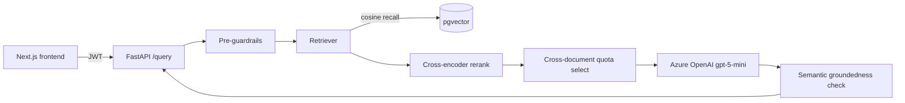

# DeployIQ — RAG Platform

A Retrieval-Augmented Generation system for the DeployIQ website content:
a FastAPI + PostgreSQL/pgvector backend and a Next.js chat/documents/metrics
frontend.

```
backend/    FastAPI service: chunking, retrieval, guardrails, LLM harness
frontend/   Next.js 14 (App Router) chat UI, auth, documents, metrics
```

## Architecture



- **LLM**: Azure OpenAI `gpt-5-mini` (reasoning model — only supports
  `temperature=1.0`; uses `max_completion_tokens`, not `max_tokens`).
- **Embeddings**: Azure OpenAI `text-embedding-3-small`, 1536-dim.
- **Retrieval pipeline**: broad pgvector cosine recall → dedupe by chunk id
  → cross-encoder rerank (`fastembed` ONNX, `Xenova/ms-marco-MiniLM-L-6-v2`,
  reorders only — the reported score stays cosine so off-topic/confidence
  gates stay calibrated) → cross-document quota selection (round-robin
  across the top-scoring documents so one document can't crowd out a second
  genuinely relevant one). Compound questions ("X and how does Y...") are
  rule-based split into sub-queries, retrieved separately, and merged.
- **Harness**: retrieve → pre-guardrails → retrieval-relevance gate → build
  prompt → call LLM → semantic groundedness check, retrying generation (not
  just on empty/error) if a sample fails groundedness, since temperature=1.0
  makes phrasing — and therefore groundedness score — vary run to run →
  structured response. If nothing is confidently grounded, the fallback
  reply (`app/harness/orchestrator.py`) tells the visitor what topics the
  assistant *can* help with instead of a bare refusal.
- **Guardrails**: pre-checks (length, spam/gibberish detection, unsafe/
  prompt-injection input), post-checks (embed the answer + retrieved
  chunks, cosine-similarity groundedness, with an explicit allowance for
  answers that correctly decline unsupported parts of a question — and a
  system-prompt rule to silently omit genuinely unsupported parts rather
  than calling out the gap, to avoid encouraging hallucinated workarounds).
- **Governance**: JWT auth, audit logging (every query/ingest recorded with
  actor, IP address, guardrail flags, cited sources), PII redaction on
  ingest — viewable via `GET /governance/audit-log` and the frontend's
  Governance page.
- **Chat sessions**: server-side, DB-backed per-user conversation history
  (`app/core/sessions.py`) — never trusted from the client. A `/query` call
  without a `session_id` auto-resumes the most recent non-expired session
  created from the *same client IP* (`app/core/request_meta.py`), or starts
  a fresh one; sessions expire after `session_timeout_minutes` of
  inactivity and silently rotate rather than erroring. Full CRUD
  (list/create/rename/delete) via `app/api/routes/sessions.py` and the
  frontend's `ChatSessionList.tsx` sidebar.
- **Rate limiting**: in-memory sliding window on `/query`
  (`app/core/rate_limit.py`) — per-user and per-IP limits enforced
  independently, so several users behind one NAT/office IP aren't
  penalized by a single abusive user.
- **Startup/latency optimizations**: the cross-encoder reranker model is
  force-loaded at process boot (`preload_reranker()`), not lazily on the
  first request; groundedness checks reuse each source chunk's
  already-computed ingestion-time embedding instead of re-embedding it
  every query; `llm_reasoning_effort` is tuned down to reduce gpt-5-mini's
  reasoning-token latency.

## Quick start

**Backend** (requires PostgreSQL with the `pgvector` extension, and an Azure
OpenAI deployment — see `backend/.env.example`):

```bash
cd backend
python -m venv venv && venv\Scripts\activate   # or source venv/bin/activate
pip install -r requirements.txt
copy .env.example .env   # fill in DATABASE_URL, AZURE_OPENAI_*, API_JWT_SECRET
alembic upgrade head
python scripts/ingest_real_docs.py
uvicorn main:app --reload
```

Requires PostgreSQL with the `pgvector` extension enabled (a Docker
`pgvector/pgvector` image works well for local dev):

```sql
CREATE EXTENSION IF NOT EXISTS vector;
```

**Frontend**:

```bash
cd frontend
npm install
copy .env.local.example .env.local   # fill in API_BASE_URL, API_KEY
npm run dev   # http://localhost:3000
```

The frontend never talks to the backend directly from the browser — the
client calls same-origin `/api/proxy/*`, a Next.js Route Handler
(`app/api/proxy/[...path]/route.ts`) that runs server-side and attaches
`API_KEY` to the forwarded request. Both `API_BASE_URL` and `API_KEY` are
server-only env vars (no `NEXT_PUBLIC_` prefix) so the key is never inlined
into the browser bundle.

The backend's CORS `allow_origins` must include `http://localhost:3000`
(already set in `main.py`).

For running the full stack in Docker instead, see [DEPLOYMENT.md](DEPLOYMENT.md).

## Backend structure

```
backend/
  app/
    core/         config, database session, latency middleware, logging,
                  chat-session lifecycle, rate limiting, client-IP extraction
    api/routes/   FastAPI route handlers (auth, ingest, query, sessions, documents, metrics, health)
    schemas/      Pydantic request/response models
    chunking/     structure-aware / fixed-size / semantic strategies + factory
    retrieval/    pgvector-backed vector store, reranker, retriever
    harness/      orchestrator (retrieve -> guardrails -> LLM -> validation) + prompts
    guardrails/   pre-query and post-answer checks
    governance/   auth, audit logging, PII redaction
    models/       SQLAlchemy ORM models
    evaluation/   RAG evaluation dataset + evaluator (see Evaluation below)
  data/real_docs/ the 8 authoritative DeployIQ Markdown docs (the corpus)
  scripts/        ingest_real_docs.py, seed_ingest.py, show_chunking.py, run_evaluation.py
  tests/          pytest unit/integration tests (no real DB or Azure calls)
```

### Backend scripts

- `scripts/ingest_real_docs.py` — (re)ingests the 8 real corpus docs; safe to
  rerun (replaces existing chunks per source document).
- `scripts/seed_ingest.py` — ingests via the live `/ingest` API instead of a
  direct DB session (needs a running server + auth token).
- `show_chunking.py` — prints one document's stored chunks (heading, char
  count, content) to sanity-check chunking output after a change.

## Frontend structure

```
frontend/
  app/
    login/page.tsx           Sign-in — split branding/form layout (AuthShell)
    register/page.tsx        Registration — same layout
    (app)/layout.tsx         Auth-guarded shell: sidebar + route group
    (app)/chat/page.tsx      Chat interface — calls POST /query
    (app)/documents/page.tsx Lists GET /documents
    (app)/metrics/page.tsx   P50/P70/P100 latency — GET /metrics/latency
  components/
    AuthShell.tsx            Shared branding panel + form slot (login/register)
    Sidebar.tsx              App nav + signed-in user + sign out
    MessageBubble.tsx        Chat bubble incl. grounded/guardrail badges, sources
  lib/
    api.ts                   Typed fetch client (adds Bearer token, parses errors)
    auth-context.tsx         Session state, persisted to localStorage
    types.ts                 Mirrors the backend's Pydantic schemas
```

### Auth flow

1. `/register` or `/login` calls the backend, which returns `{ access_token, user }`.
2. The token + user are kept in React context and mirrored to
   `localStorage` under `deployiq.session`, so a refresh stays signed in.
3. `lib/api.ts` attaches `Authorization: Bearer <token>` to every
   authenticated call (`/query`, `/documents`, `/metrics/latency`, `/ingest`).
4. `(app)/layout.tsx` redirects to `/login` if there's no token once the
   stored session has finished loading.

### Design

The login/register split-panel layout (dark gradient brand panel + white
form panel) follows the reference screens supplied for this project. The
left panel's copy, the 6-stage pipeline strip (Understand → Recommend →
Implement → Validate → Monitor → Improve), and the footer line are drawn
from DeployIQ's own platform and About Us content rather than placeholder
text — update `components/AuthShell.tsx` if that copy changes.

## Data

The corpus is the 8 authoritative DeployIQ website Markdown documents in
`backend/data/real_docs/` (home page, about us, platform overview, Zero
Trust, Essential Eight, Responsible AI, Trust Center). Re-ingest after any
chunking/embedding change with `python scripts/ingest_real_docs.py`.

## Tests

`backend/tests/` is a pytest suite covering the pure/mockable logic — no
live Postgres or Azure calls required, runs in ~2s:

- chunking (`StructureAwareChunker` heading-nesting/bold-stripping/oversized-split rules)
- `decompose_query`, pre-checks, post-checks (negative-answer regex, cosine
  groundedness — embeddings mocked), reranker (cross-encoder mocked)
- `VectorStore._select_diverse_chunks` cross-document quota logic
- the orchestrator's full retry/fallback state machine (pre-guardrail block,
  off-topic, empty/failed LLM, groundedness-retry success/exhaustion) with
  `retrieve`/`call_llm`/`run_post_checks` monkeypatched

```bash
cd backend
python -m pytest -q
```

`pytest.ini` sets `pythonpath = .` and `asyncio_mode = auto` so async tests
work without extra decorators. `scripts/run_evaluation.py` is the
complementary *live* check (real DB + real Azure calls, see Evaluation).

## Continuous integration

GitHub Actions runs the backend pytest suite and the frontend lint and
production build checks on all pushes and on pull requests targeting `main`.
These checks do not require database or Azure credentials. The workflow
is defined in `.github/workflows/ci.yml`.

Run the same checks locally:

```bash
cd backend
python -m pip install -r requirements.txt
python -m pytest -q

cd ../frontend
npm ci
npm run lint
npm run build
```

## Evaluation

`app/evaluation/dataset.py` defines a curated set of test queries covering
every corpus document plus the pipeline behaviors the harness specifically
handles: a compound cross-document question, a negative/unsupported-detail
question, off-topic questions, and an unsafe-input pre-guardrail check.
`app/evaluation/evaluator.py` runs each case through the real pipeline
(`run_query` — real embedding + real LLM calls) and scores:

- **retrieval_recall** — did retrieval surface at least one of the expected
  source documents for each case that specifies them.
- **groundedness_accuracy** — did `grounded` match what the case expects
  (true for answerable/compound/negative cases, false for off-topic/unsafe).
- **pass_rate** — retrieval hit AND groundedness AND guardrail-flag
  expectations all satisfied.
- **P50/P70/P100 latency**, overall and per pipeline stage — this is what
  satisfies the "submit P50/P70/P100 latency numbers... measured across a
  reasonable number of test queries" requirement.

Run it with:

```bash
cd backend
python scripts/run_evaluation.py --json eval_report.json
```

Most recent real run (13 cases, real Azure calls): **92.3% pass rate, 90%
retrieval recall, 100% groundedness accuracy**; latency p50/p70/p100 (ms) —
total 17826/18694/27349, retrieval 6383/7612/11952, llm 8073/8993/10558,
guardrail_post 4113/4836/6157. The 200ms budget is now measured against
retrieval + guardrails only, not the full pipeline (see Latency section) —
though note even that redefined metric is still far over budget in this
run, since real pgvector/rerank/Azure-embedding calls take seconds, not
milliseconds. Reported honestly, not silently marked as met.

**Since that run**, three latency optimizations landed (`llm_reasoning_effort`
tuned down, reranker preloaded at startup instead of lazily on the first
request, groundedness checks reusing ingestion-time source embeddings
instead of re-embedding every query) — live-measured steady-state is now
closer to **llm ~4.2-4.9s, guardrail_post ~1.3-1.4s, total ~9.7-10s** per
`/query`. `eval_report.json` hasn't been regenerated against these changes
yet — re-run `scripts/run_evaluation.py` before quoting fresh official
numbers.

## Latency & metrics

`LatencyMiddleware` (`backend/app/core/middleware.py`) times every
`POST /query` request end-to-end and persists a `LatencyRecord` per request,
broken down by stage: `retrieval_ms` (embedding + pgvector recall + rerank +
selection), `guardrail_pre_ms`, `llm_ms` (generation, including any
groundedness-triggered retries), `guardrail_post_ms`. Every response also
carries `X-Request-ID` / `X-Latency-MS` headers.

`GET /metrics/latency` (auth required) reports three P50/P70/P100 views plus
a per-stage breakdown:

- `pipeline_ex_llm` — `guardrail_pre_ms + retrieval_ms + guardrail_post_ms`,
  the only view checked against `Settings.latency_budget_ms` (default 200ms
  — see `backend/app/core/config.py`), reported as `within_budget_pct`.
- `end_to_end` — the full `/query` request (`total_ms`), informational only.
- `llm` — the generation stage alone, informational only.

A real LLM call regularly takes several seconds, so it's deliberately
excluded from the budgeted metric rather than making the 200ms number
meaningless (see Latency section below). The frontend's `(app)/metrics`
page renders all three. Note: `embedding_ms` is captured in the schema/DB
column but not currently split out from `retrieval_ms` — embedding happens
inside the retrieval stage — so it will always read `null` today.

## Security

`.env` holds real Azure OpenAI and JWT secrets — never commit it (see the
root [.gitignore](.gitignore), which covers both `backend/.env` and
`frontend/.env.local`). Treat any key ever committed/pasted outside your
local `.env`, or duplicated into `.env.example`, as compromised and rotate
it.
